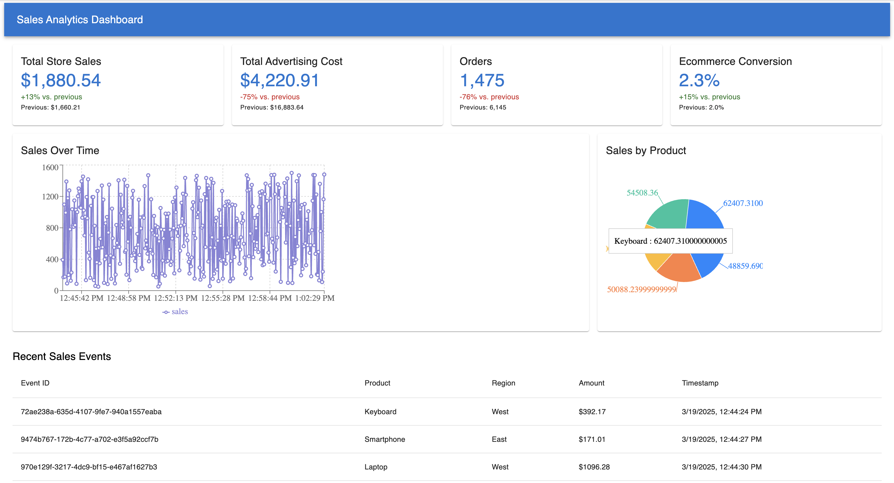

# Real-Time Sales Dashboard

This is a real-time sales analytics application that uses:
- **Kafka** (Zookeeper + Kafka broker) for event streaming,
- A **Python Producer** that generates mock sales events,
- A **Go Consumer** that reads events from Kafka and exposes them via HTTP,
- A **React** (Material UI + Recharts) frontend that displays a real-time sales dashboard.

## Features
- **Mocked Sales Data**: Python sends product, region, and amount info to Kafka.
- **Go Backend**: Listens for events, stores them in memory, and serves them at `/events`.
- **React Dashboard**: Shows:
  - Overview cards (static example stats),
  - A line chart of sales over time,
  - A pie chart of sales by product,
  - A table of recent events.

## Prerequisites
1. **Docker or Podman** (to run Kafka + Zookeeper via Compose).
2. **Go** (1.16+).
3. **Python 3** with `kafka-python` installed.
4. **Node.js & npm** (for the React app).

## Installation & Setup

1. **Clone or Download** this repository.
2. **Start Kafka & Zookeeper**:
   - Using Docker Compose:
     ```bash
     docker compose up -d
     ```
   - Or Podman Compose:
     ```bash
     podman machine init
     podman machine start
     podman-compose up -d
     ```
3. **Go Consumer**:
   ```bash
   cd backend/go-cloud-function
   go mod tidy
   go run main.go

This will start a server on http://localhost:8080.
Python Producer:
cd kafka-producer
pip install kafka-python
python producer.py
This sends mock events every few seconds to the Kafka topic.
React Frontend:
cd frontend
npm install
npm start
Opens the dashboard at http://localhost:3000.